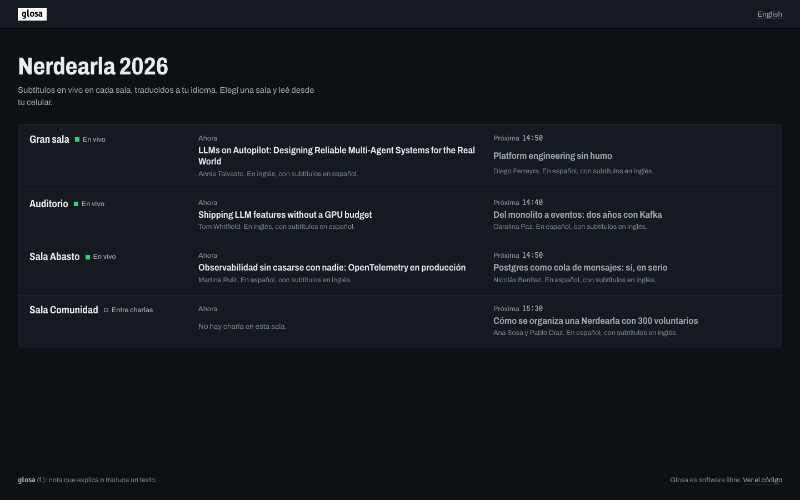
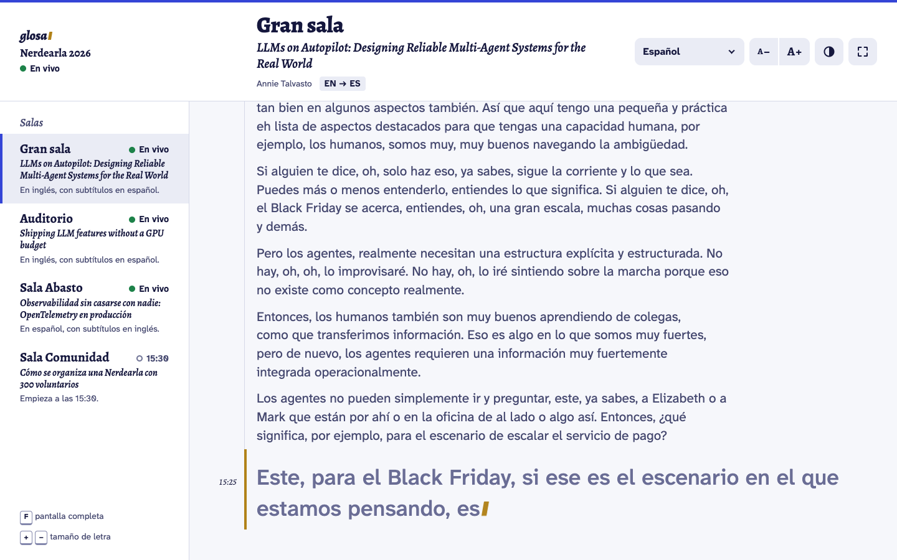
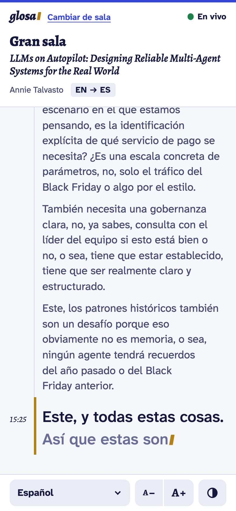
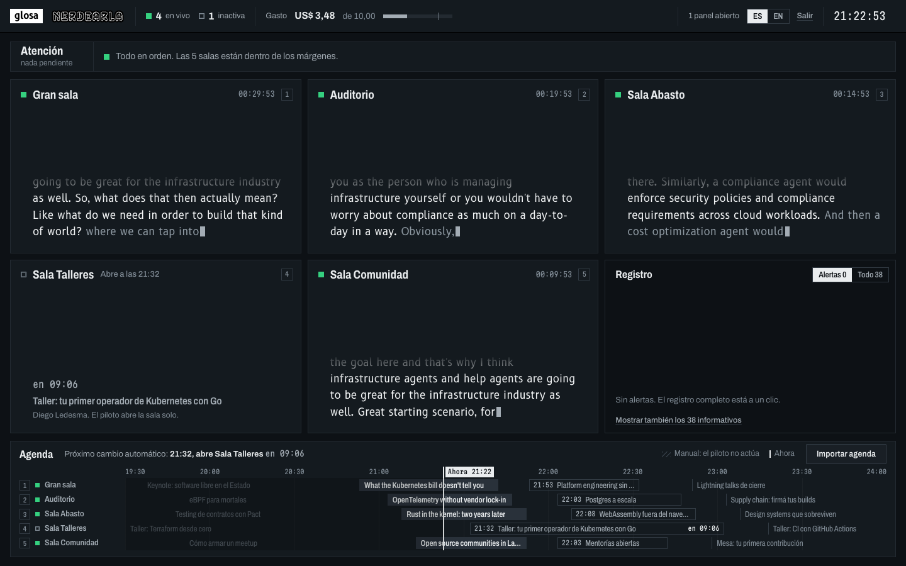
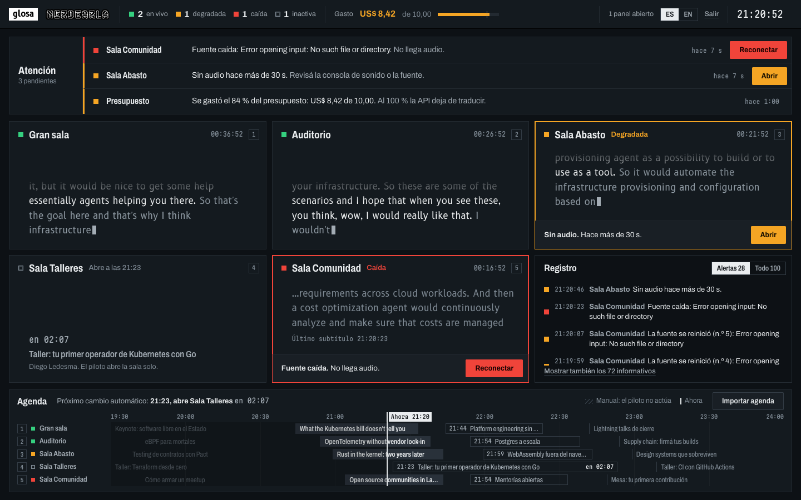
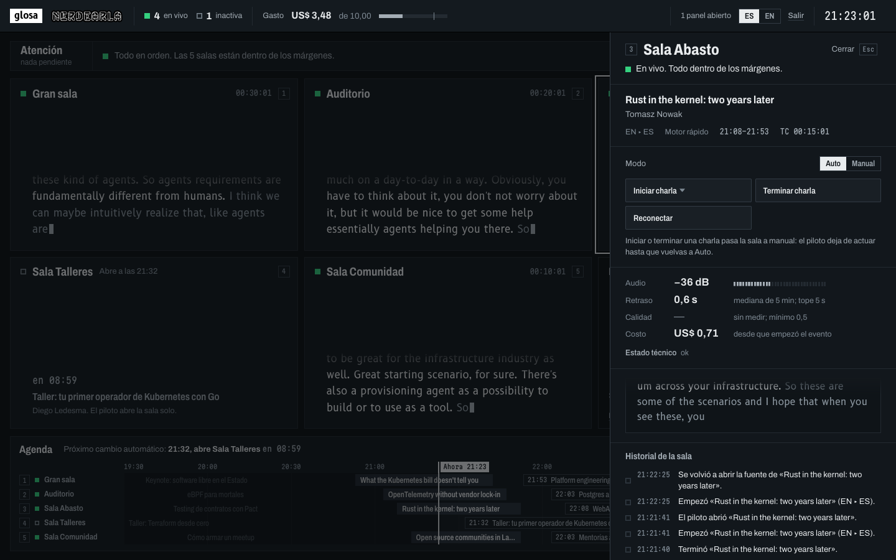
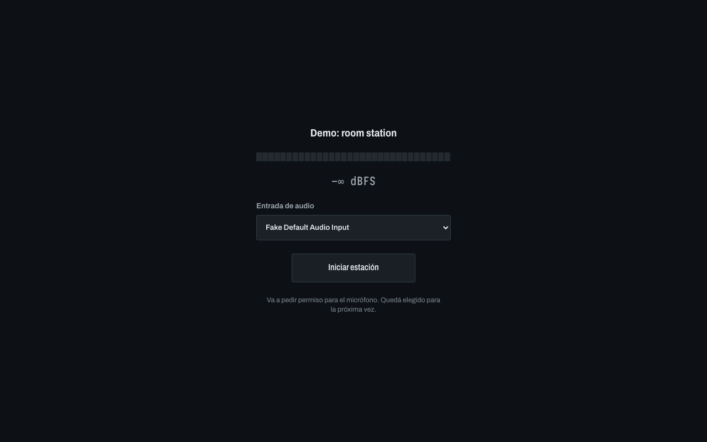
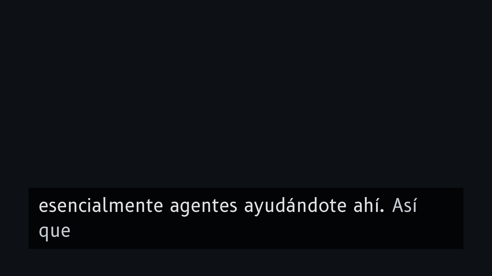
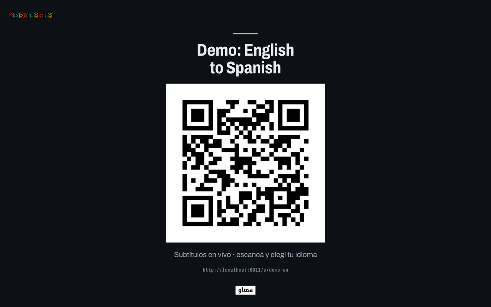
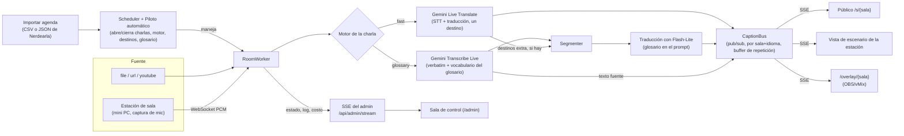

# Glosa

*[Read in English](README.md)*

Subtitulado y traducción en vivo, de código abierto y pensado para eventos,
para charlas de conferencias. Apuntá Glosa a una fuente de audio — una URL
de streaming, un link de YouTube, o una mini PC que capta la consola de
audio del escenario — y subtitula y traduce la charla en tiempo real a un
celular, a una pantalla de escenario o a un overlay de OBS/vMix. Cargá la
agenda del evento una sola vez y un piloto automático abre y cierra las
charlas de cada sala según el horario, cambiando idioma, motor y glosario
con ella, así nadie tiene que apretar iniciar/detener charla por charla.
Corre sobre dos motores de Gemini intercambiables — uno rápido y fluido, y
otro fiel al glosario para charlas técnicas — a **hasta ~30 veces menos**
que el precio de lista público del SaaS comercial que usa Nerdearla hoy
para esto (ver [Costos](#costos) y [`docs/costs.md`](docs/costs.md)).

## Capturas

| | |
|---|---|
|  Lista de salas (`/`) |  Subtítulos en vivo (`/s/{sala}`), escritorio |
|  Subtítulos en vivo, celular |  Admin ("Sala de control"), todo en orden |
|  Admin, barra de Atención con un problema |  El cajón de una sala (modo, reconectar, estación, exportaciones) |
|  Estación de sala (`/station/{sala}`) |  Overlay de OBS/vMix (`/overlay/{sala}`) |
|  Página de QR para imprimir (`/qr/{sala}`) | |

Más capturas (temas claro/oscuro/alto contraste, vista bilingüe, el editor
de agenda, el login): `docs/screenshots/*.png`.

## Inicio rápido

```bash
git clone https://github.com/martin-paladino/glosa.git && cd glosa
cp .env.example .env   # completá GEMINI_API_KEY y ADMIN_PASSWORD, ver Configuración más abajo
make demo               # o: docker compose up
```

Abrí **http://localhost:8000**. Vienen dos salas subtitulando los clips de
muestra incluidos (`samples/en_clip.opus`, `samples/es_clip.opus`) a
velocidad real, en inglés y español, cada una con una traducción en vivo al
otro idioma. `make demo` / `docker compose up` a secas corren Gemini de
verdad (cuesta unos US$0,10 por los dos clips de ~90 s); `make demo-fake` /
`GLOSA_CONFIG=config.demo-fake.yaml docker compose up` hacen lo mismo sin
API key y sin costo, repitiendo una sesión grabada en su lugar.

Para correr tu propio evento en vez de la demo:

```bash
cp config.example.yaml config.yaml   # describí tus salas, agenda, marca
make run                              # o, con Docker: ver más abajo
```

`config.yaml` nunca es tocado por `make demo`/`make demo-fake` (usan sus
propios configs versionados, `config.demo.yaml` / `config.demo-fake.yaml`),
así que podés probar la demo y armar tu evento real en paralelo.

**Corriendo tu propio evento con Docker:** `config.yaml` deliberadamente
nunca se incluye en la imagen (ver `.dockerignore`) ni se lee del entorno
del host (ver *Secretos*, más abajo), así que montalo explícitamente y
apuntá `GLOSA_CONFIG` a él:

```bash
GLOSA_CONFIG=config.yaml docker compose run --rm -p 8000:8000 -v "$PWD/config.yaml:/app/config.yaml:ro" glosa
```

o agregá la misma línea de volumen a un `docker-compose.override.yml`
local (Compose lo combina automáticamente) para que el simple
`GLOSA_CONFIG=config.yaml docker compose up` lo tome siempre.

## Configuración

### Secretos (`.env`)

| Variable | Requerida | Para qué es |
|---|---|---|
| `GEMINI_API_KEY` | sí | Impulsa el subtitulado/traducción en vivo (Gemini Live). Conseguí una en [Google AI Studio](https://aistudio.google.com/). Se factura por minuto de audio (ver [Costos](#costos)); `make demo-fake` no necesita ninguna key. |
| `ADMIN_PASSWORD` | sí | La única contraseña para `/admin`. Al menos 8 caracteres — Glosa se niega a arrancar si no. Usá una larga y aleatoria, p. ej. `openssl rand -base64 18`; es lo único que separa a internet de los controles de tus salas y de las claves de captura de las estaciones. |
| `TYPESAFE_API_KEY` | no | Habilita el medidor de calidad Jev. Dejala vacía para omitirlo — todo lo demás funciona sin ella. Con una key configurada, el medidor puntúa un par de subtítulos cada 15 s por sala, solo inglés↔español; otros pares de idiomas, y las salas sin key, mantienen la lectura de "calidad" en "—". |

Los secretos viven solo en `.env` (ignorado por git) y se leen directamente
de ese archivo, nunca del entorno del shell/contenedor (así una variable
exportada por accidente, o un `docker inspect`, no puede filtrarlos — ver
el comentario de `docker-compose.yml`). Nunca los pongas en `config.yaml`
ni los commitees.

### El evento (`config.yaml`)

Copiá `config.example.yaml` a `config.yaml`. Todas las claves son
opcionales; lo que omitas cae en los valores por defecto de
`glosa/config.py`. Lo esencial:

```yaml
event_name: Nerdearla Vibeathon 2026
timezone: America/Argentina/Buenos_Aires
audience_mode: all   # o "qr_only": sin lista pública de salas, solo funciona el link del QR

rooms:
  - id: main
    name: Main Stage
    agenda_names: [gran-sala]     # cómo llama a esta sala la agenda externa
    source_type: youtube          # file | url | youtube | emitter (estación de sala)
    source_url: "https://www.youtube.com/watch?v=..."
    language: es                  # idioma de origen de la sesión libre de esta sala
    default_targets: [en]

engine_mode: live       # "fake" repite una sesión grabada, sin necesitar API key
default_engine_en: fast # motor para una charla en inglés que no especifica uno
db_path: data/glosa.db
budget_usd: 10.0
exports_public: true

prices: { lt_per_min: 0.0368, transcribe_per_min: 0.009, flash_lite_in_per_m: 0.30, flash_lite_out_per_m: 2.50 }
relay: { standby_at: 510, force_at: 570, stall_timeout: 8.0 }   # relevo de sesión de Live Translate
vad: { pause_ms: 400, min_speech_s: 1.5 }
segmenter: { comma_min_words: 5, max_words: 14, max_wait_s: 3.0 }
```

`branding.logo_url`/`primary`/`accent` definen la imagen del evento (el
logo de Nerdearla incluido se puede reemplazar por el tuyo). Referencia
completa clave por clave: los comentarios de `config.example.yaml` y
`Settings` en `glosa/config.py`.

## Cómo funciona



- **RoomWorker** (`glosa/room.py`) es dueño de toda la vida de una sala: su
  fuente de audio, la sesión del motor, la lane de traducción y su estado.
  Cada `RoomWorker` corre como su propio conjunto de tareas `asyncio` por
  sala, en el mismo proceso — ver [Escala](#escala).
- **Dos motores, elegidos por charla** (`engine: fast|glossary` en el CSV
  de la agenda o `PUT /api/admin/talks/<id>`; las charlas en español usan
  `glossary` por defecto, las de inglés `default_engine_en`): **fast** es
  una única sesión de Gemini Live Translate haciendo STT y traducción
  juntos, fluida pero ciega al glosario; **glossary** es Gemini Transcribe
  Live (verbatim, alimentado con el glosario como `customVocabulary`)
  seguido de un segmentador y un paso de traducción con Flash-Lite con el
  glosario en su prompt — más lenta por palabra, pero la única que respeta
  los términos configurados. Ver [`docs/alternatives.md`](docs/alternatives.md)
  (en inglés) para el porqué.
- **Los destinos más allá del primero** (la lista `targets` de una charla
  puede tener más de un idioma) se traducen a partir del texto fuente ya
  transcripto, con la misma lane de Flash-Lite que usa el motor
  `glossary`, en vez de abrir una segunda sesión en vivo — ver
  [Costos](#costos).
- **`CaptionBus`** (`glosa/captions/bus.py`) es un pub/sub dentro del
  proceso, con un tema por `(sala, idioma)` y un buffer de repetición
  acotado, así un cliente SSE nuevo o que retoma la conexión se pone al
  día antes de pasar a la entrega en vivo — ver [Escala](#escala) para sus
  números de reparto bajo carga.
- **Agenda y piloto automático**: importá una agenda una vez (CSV o el
  JSON de sesiones de Nerdearla, `POST /api/admin/agenda/import`) y cada
  sala en modo `auto` (el default) abre una charla 60 s antes de su
  horario de inicio y la cierra en su fin, cambiando idioma, motor,
  destinos y glosario con ella; el modo `manual` le devuelve la sala al
  operador. Referencia completa de endpoints:
  [`docs/operator-guide.md`](docs/operator-guide.md) (en inglés).
- **SSE del admin** (`GET /api/admin/stream`) es el feed en vivo, aparte,
  detrás del panel **"Sala de control"** de `/admin`: el estado de cada
  sala una vez por segundo, el log de eventos, los cambios de agenda y el
  medidor de gasto — ver [`docs/operator-guide.md`](docs/operator-guide.md)
  para qué muestra el panel y cómo leerlo.

### Qué trae la caja

- **Vista del público** (`/`, `/s/{sala}`): subtítulos en vivo por sala
  sobre SSE, pensada primero para el celular, interfaz ES/EN, temas
  claro/oscuro/alto contraste. `/qr/{sala}` es una página para imprimir o
  proyectar con el código QR de esa sala. `audience_mode: qr_only` oculta
  por completo la lista de salas en `/` y solo acepta el link QR de una
  sala (`/s/{token}`), para un evento que no quiere su lista de salas
  adivinable o pública — en este modo nada público revela la
  correspondencia sala→token ni sus subtítulos sin el token.
- **Overlay para OBS/vMix** (`/overlay/{sala}?lang=es&lines=2&size=48`,
  agregá `&logo=1` para el logo del evento): una página transparente, sin
  chrome, que una entrada de navegador de vMix o una fuente de navegador
  de OBS lee, quemando los subtítulos traducidos en el stream. En modo
  `qr_only` usá `/overlay/s/{token}` en vez de la forma con slug.
- **Admin** (`/admin`, "Sala de control"): cada sala es un monitor con sus
  subtítulos en vivo, una luz de estado y su tiempo al aire. La barra de
  **Atención** lista solo lo que necesita acción ahora (una sala caída o
  degradada y por qué, el presupuesto al 80 %, una alarma de silencio); la
  fila de una sala trae un botón de un clic para reconectar/reabrir la
  fuente. Además: el medidor de gasto, el log de eventos, la agenda de hoy
  con el próximo cambio automático, y un cajón por sala (hacé clic o
  apretá 1–9; Esc cierra) con auto/manual, iniciar/terminar charla,
  reconectar, **"Probar con audio"** (reproducir una muestra o un archivo
  subido a través de la sala para juzgar la calidad sin una charla en
  vivo), **"Escuchar el audio"** (un admin puede escuchar ese audio de
  prueba sincronizado con los subtítulos), una lista de exportaciones,
  cada métrica contra su límite y el historial de la sala, y — para una
  estación de sala — su estado de conexión, link, código QR y **"Recargar
  estación"**. Ver [`docs/operator-guide.md`](docs/operator-guide.md) (en
  inglés) para la referencia completa de botones.
- **Docker**: `docker-compose.yml` construye la misma app, monta `.env` y
  persiste `data/` (la base SQLite: agenda, subtítulos, eventos, costo) a
  través de reinicios.

### Estaciones de sala (una mini PC por escenario)

Configurá una sala con `source_type: emitter` en `config.yaml` y su mini PC
abre `/station/<sala>?key=<station_key>` en vez de una pestaña de un SaaS:
capta el audio de la consola desde el navegador, lo transmite a Glosa, y
muestra los subtítulos de esa sala en pantalla completa para las pantallas
del escenario (`docs/field-notes.md` tiene la historia detrás de esto —
ver [Operación](#operación)). La URL es estable a través de un reinicio
del servidor, y se revoca cambiando `ADMIN_PASSWORD`. Un reinicio remoto
("F5 remoto", sin RustDesk) es un clic en el admin (`POST
/api/admin/rooms/<id>/station/reload`).

**La clave nunca se filtra.** Toda página envía `Referrer-Policy:
same-origin`, así el `?key=...` de una estación nunca se manda como
Referer al pedido de Google Fonts que hace `base.html`. Los propios logs
de Glosa (los de uvicorn) tienen cada `key=<...>` reescrito a
`key=REDACTED` antes de escribirse. Un proxy inverso delante de Glosa
mantiene su **propio** log, así que redactalo ahí también — para Caddy:

```caddyfile
log {
	format filter {
		wrap console
		fields {
			request>uri query {
				replace key REDACTED
			}
		}
	}
}
```

**HTTPS es obligatorio.** Los navegadores solo permiten captura de
micrófono (`getUserMedia`) en un contexto seguro; una mini PC que abre
`http://<servidor>:8000` en la red del lugar no puede capturar audio, y la
página de la estación explica esto en pantalla en vez de fallar en
silencio. Ver [Despliegue](#despliegue).

**Modo kiosco**, para una mini PC desatendida:

```bash
google-chrome \
  --kiosk "https://<tu-dominio>/station/<sala>?key=<station_key>" \
  --autoplay-policy=no-user-gesture-required \
  --user-data-dir=/home/glosa/chrome-station-<sala>
```

`--kiosk`: pantalla completa, sin chrome del navegador.
`--autoplay-policy=no-user-gesture-required`: deja que la página arranque
su `AudioContext` al cargar. Un `--user-data-dir` **persistente** (una
ruta real) es lo que hace que el permiso de micrófono se mantenga a través
de reinicios y reboots — concedelo una vez.

## Resultados

### Carga: reparto de subtítulos

Prueba de carga simulada (Task 15a, `bench/load_test.py`; un servidor
real, `engine_mode: fake`, cero gasto de API), Apple M4 / 10 núcleos / 16
GB:

| Salas | Clientes | Duración | Pérdidas | Reparto p50 / p95 / p99 (ms) | CPU del servidor prom. / pico | Resultado |
|---|---|---|---|---|---|---|
| 5 | 50 | 20 s | 0 | 0,9 / 3,1 / 4,1 | 5,3 % / 59,6 % | PASA |
| 50 | 500 | 60 s | 0 | 0,8 / 1,9 / 4,8 | 17,9 % / 62,5 % | PASA |
| 100 | 1000 | 60 s | 0 | 0,6 / 1,6 / 6,3 | 23,6 % / 95,4 % | FALLA (CPU) |

La corrida a escala del plan (50 salas / 500 conexiones concurrentes de
público / 60 s) pasa con margen en todos los criterios (sin pérdidas, sin
reconexiones, CPU bien por debajo del 80 %). A 2× escala, el retraso de
reparto se mantiene igual de bueno, pero abrir 1000 conexiones SSE en
cerca de un segundo hace que la CPU del servidor llegue a 93–95 % por un
par de muestras — una ráfaga de establecimiento de conexiones de una sola
vez, no un costo de reparto sostenido (la CPU en régimen estable a 1000
clientes es de ~23 %, apenas por encima del régimen estable a 500). Método
completo, hallazgos y comando de reproducción:
[`bench/load-results.md`](bench/load-results.md) (en inglés).

### Latencia y calidad de los motores

<!-- BENCH-RESULTS -->
| Clip | Motor | Retraso del texto original p50 / p90 | Retraso de la traducción p50 / p90 | Fidelidad | Fluidez | Términos del glosario | US$/h |
|---|---|---|---|---|---|---|---|
| Charla EN → ES | fast (Live Translate) | 1,28 / 2,08 s | 1,40 / 3,84 s | 4/5 | 3/5 | 94 % | 2,19 |
| Charla EN → ES | glossary (Transcribe Live + Flash-Lite) | **0,69 / 1,59 s** | **1,34** / 4,25 s | 3/5 | 2/5 | **100 %** | **0,70** |
| Charla ES → EN | fast (Live Translate) | 1,66 / 2,35 s | 2,57 / 3,90 s | 5/5 | 4/5 | 100 % | 2,16 |
| Charla ES → EN | glossary (Transcribe Live + Flash-Lite) | **0,52 / 1,33 s** | **1,76** / 5,59 s | 3/5 | 2/5 | 94 % | **0,74** |

APIs reales de Gemini, a velocidad real, clips de ~93 s de charlas reales de Nerdearla, una corrida por combinación (US$0,16 en total). Retraso = cuánto van los subtítulos detrás de quien habla, medido sobre curvas acumuladas de palabras contra los tiempos por palabra de YouTube; fidelidad y fluidez las puntúa un LLM juez (`gemini-3.8-flash`) contra una traducción de referencia — con una sola corrida son orientativas. Método completo, grabaciones crudas y `make bench`: [`bench/results.md`](bench/results.md). Por defecto: `fast` para charlas en inglés (más fluido) y `glossary` para charlas en español (3× más barato y respeta el glosario).


La propia latencia del motor `glossary`, medida en vivo durante esta
build (6 corridas de 60 s de audio en español,
`.superpowers/sdd/2026-09-24-glosa/progress.md`): fuente (transcripción)
**p50 ≈ 0,9 s** desde el fin del habla, traducción **p50 ≈ 0,7 s** desde el
corte. Tabla completa de latencia/costo para ambos motores, con fuentes:
[`docs/alternatives.md`](docs/alternatives.md) (en inglés).

## Costos

Por hora-sala, un idioma de destino (precios de lista de Gemini,
`glosa/config.py`):

| Motor | US$/min | US$/hora | ¿Glosario? |
|---|---|---|---|
| **fast** (Live Translate) | 0,0368 | ≈ US$2,21 | No |
| **glossary** (Transcribe Live + Flash-Lite) | ≈0,012 | ≈ US$0,72 | Sí |

Cada idioma de destino extra (más allá del primero) suma un paso más de
traducción con Flash-Lite sobre el mismo texto ya transcripto — al costo
aproximado de traducción del motor `glossary`, sin una sesión de
transcripción nueva.

**vs. Maestra** (el SaaS que usa Nerdearla hoy), precio de lista público
relevado el 2026-09-23: **≈ US$24/h por idioma traducido**. A la misma
escala, eso es aproximadamente **11×** el costo del motor `fast` de arriba
y **≈33×** el del motor `glossary` — una comparación de precio de lista
contra precio de lista, no una tarifa negociada de ningún lado. Desglose
completo (estimaciones a escala de evento, el gasto propio de esta build,
el costo del servidor, el tope de presupuesto): ver
[`docs/costs.md`](docs/costs.md) (en inglés).

## Modo local (sin nube)

`engine_mode: local` corre captions + traducción enteramente en el
dispositivo, en una Mac Apple Silicon — sin Gemini, sin internet, sin
gastar API key. Es un **modo demo/de respaldo** ("no hay internet en la
sede"), honesto sobre sus límites: **1–2 salas por máquina**, y ni la
transcripción ni la traducción aplican el glosario de la charla (ver los
límites abajo). Usa
[Parakeet](https://huggingface.co/mlx-community/parakeet-tdt-0.6b-v3)
(`parakeet-mlx`) para speech-to-text y
[TranslateGemma](https://huggingface.co/mlx-community/translategemma-4b-it-4bit)
(`mlx-lm`) para traducción, ambos vía [MLX](https://github.com/ml-explore/mlx).

```bash
uv sync --extra local   # solo Apple Silicon; instala mlx, mlx-lm, parakeet-mlx
make demo-local          # PORT=8014; descarga ~4.5 GB de pesos la primera vez
```

`glosa/engines/local.py` (`LocalParakeetEngine`) y
`glosa/text/local_translator.py` (`LocalTranslator`) implementan los mismos
contratos `Engine`/`Translator` que los motores en la nube, así que el
resto del pipeline (glosario, segmentador, captions, exports) no cambia;
el modo local fuerza a toda charla al *camino* del motor glossary (no hay
Live Translate local), sea cual sea el `engine` propio de la charla.

**Medido** (2026-09-25, la máquina de build — Apple M4, 16 GB — corridas en
tiempo real de `samples/en_clip.opus`/`es_clip.opus`, ~93 s cada uno,
`bench/bench_local.py`, reusando la métrica progress-lag de
`bench/json3.py`):

| Salas | Clip | Latencia origen p50/p90 | Atraso traducción p50/p90 | CPU% prom/máx | RSS MB prom/máx | Memoria pico MLX |
|---|---|---|---|---|---|---|
| 1 | en→es | 1,6 s / 2,6 s | 3,7 s / 5,5 s | — | — | 6,0 GB |
| 2 | en→es | 3,8 s / 6,2 s | 6,6 s / 10,3 s | 44% / 101% | 571 / 1333 | 5,8 GB |
| 2 | es→en | 5,3 s / 7,6 s | 7,2 s / 9,1 s | (mismo proceso) | (mismo proceso) | (mismo proceso) |

Ambos modelos quedan cargados una sola vez por proceso (una instancia
compartida, un lock, detrás de un thread dedicado — los streams de cómputo
de MLX son thread-local, un problema conocido en todo el ecosistema MLX
desde mlx 0.31+); una segunda sala aproximadamente duplica la latencia
porque ahora espera su turno en ese mismo lock. Tanto la corrida de 1 como
la de 2 salas se mantuvieron al ritmo del tiempo real (el tiempo total de
pared ≈ la duración del propio clip): el cuello de botella es la latencia
por llamada bajo carga, no el throughput. CPU/RSS son de este proceso
(`ps`, muestreado cada 0,5 s); "memoria pico MLX" es
`mlx.core.get_peak_memory()`, el máximo histórico de memoria unificada de
los modelos — no es la misma cifra que el RSS del proceso (la memoria
Metal/unificada no se refleja del todo en el RSS en Apple Silicon). Diez
segmentos traducidos por clip, y la salida completa de la corrida, están
en el reporte de esta tarea
(`.superpowers/sdd/2026-09-24-glosa/task-16-report.md`).

**Límites, con honestidad:**
- **1–2 salas por máquina** — ver los números arriba; una tercera sala
  concurrente haría cola detrás del mismo lock y empujaría la latencia
  bastante más allá de lo que una audiencia en vivo puede leer cómodamente.
- **El glosario no se aplica**, ni a la transcripción ni a la traducción.
  Parakeet no tiene un gancho de vocabulario propio (a diferencia del
  `customVocabulary` de transcribe-live); el formato de prompt de
  TranslateGemma (verificado contra su propio `chat_template.jinja`) no
  tiene lugar para instrucciones extra más allá del segmento y sus códigos
  de idioma origen/destino.
- **Sin contexto entre segmentos** para la traducción (Translator
  normalmente pasa los últimos segmentos para dar continuidad; el modo
  local traduce cada segmento de forma independiente).
- **Transcripción por ventana móvil, no streaming real.**
  `parakeet-mlx` sí ofrece un decodificador streaming de verdad, pero no se
  consideró que valiera la complejidad de ciclo de vida agregada (un
  contexto con caché KV/modo de atención con estado por sala, compartido
  con cuidado contra un modelo de proceso compartido) para un respaldo de
  hackathon de prioridad mínima; en cambio, retranscribe el audio
  acumulado del enunciado abierto con el decodificador batch normal, que
  los números de arriba muestran que alcanza a esta escala.
- **Empaquetado:** el extra `local` (`pyproject.toml`) está condicionado a
  `sys_platform == 'darwin' and platform_machine == 'arm64'`, así que una
  instalación Linux/Docker no se ve afectada; los tests unitarios inyectan
  funciones falsas de transcripción/generación y nunca necesitan mlx
  instalado.

## Alternativas evaluadas

Los dos motores de Glosa se eligieron después de compararlos entre sí y
contra Soniox, la traducción en tiempo real de OpenAI, Whisper, Gemma,
Gemini Omni, un montaje local con NVIDIA Parakeet, y TypeSafe Jev (tanto
como heurística de segmentación como el medidor de calidad que usa
Glosa). Tablas completas con latencia, costo, soporte de glosario y
fuentes: [`docs/alternatives.md`](docs/alternatives.md) (en inglés).

## Escala

- **Una instancia de Glosa corre un evento.** Cada sala es su propio
  conjunto de tareas `asyncio` (ingesta de audio, sesión del motor, lane
  de traducción) dentro de un único proceso — sin cola externa ni pool de
  workers. El reparto pub/sub de `CaptionBus` midió p95 1,9 ms / p99 4,8
  ms con 50 salas / 500 conexiones concurrentes de público, con la CPU del
  servidor llegando a un pico de 62,5 % de un núcleo — ver
  [Resultados](#resultados).
- **Una instancia maneja cómodamente unas 10–20 salas subtitulando a la
  vez.** El cuello de botella es la cantidad de sesiones concurrentes de
  Gemini Live y su I/O de red (cada sala mantiene 1–2 sesiones abiertas
  por el solapamiento del relevo de sesión), no la CPU — ffmpeg, el VAD y
  la segmentación son baratos por sala. Qué dimensionar: los límites de
  tasa/concurrencia por nivel de Gemini (revisalos en Google AI Studio con
  anticipación), y, para salas `file`/`url`/`youtube`, un subproceso
  `ffmpeg` por sala (unos 115 puntos porcentuales de CPU y ~150 MB de RSS
  con 50 salas así en la prueba de carga) — un despliegue con mayoría de
  estaciones de sala `emitter` (las mini PC empujan el audio; sin `ffmpeg`
  local) necesita mucho menos.
- **Más allá de unas ~20 salas, dividí entre instancias** — un proceso por
  edificio/track, cada uno con su propio subconjunto de salas en
  `config.yaml` y su propio `db_path` (SQLite; sin estado compartido entre
  instancias). Apuntá el panel de admin y los links del público de cada
  instancia a su propio host/puerto.
- **Presupuestá por minutos de audio**, no por cantidad de salas: ver
  [Costos](#costos).
- **La compuerta de silencio deja de facturar audio entre charlas y en pausas largas.** Después de `silence_gate_s` segundos sin voz (20 s por defecto; 0 la desactiva — `config.yaml`), la sala deja de enviar audio al motor (guarda 1 s de pre-roll y lo manda primero cuando vuelve la voz, así no se pierde nada); en un día con tiempos muertos entre charlas esto baja bastante los minutos de audio facturados por sala. Los segundos ahorrados figuran en el estado de cada sala (`gated_s`), y el detalle de la sala en el admin muestra "silence gate: paused Ns" mientras está activa.

## Despliegue

```bash
docker compose up   # construye la imagen, monta .env y data/ (ver Inicio rápido)
```

Las estaciones de sala necesitan HTTPS (los navegadores solo permiten
captura de micrófono en un contexto seguro) — tres formas, en orden de qué
tan cerca están de un lugar real: **`deploy/Caddyfile`** (un proxy inverso
que consigue un certificado real de Let's Encrypt, o uno autofirmado solo
para la LAN vía `tls internal`; `docker-compose.yml` tiene un servicio
`caddy` comentado para esto, y fija `flush_interval -1` para que los
subtítulos en vivo no se buffereen); un **túnel HTTPS** (ngrok, Cloudflare
Tunnel, Tailscale Funnel...) a `localhost:8000` para un ensayo rápido; o,
solo en el laboratorio, la flag de Chrome
`--unsafely-treat-insecure-origin-as-secure` — nunca para un evento real.
Configuración completa y flags del modo kiosco:
[Estaciones de sala](#estaciones-de-sala-una-mini-pc-por-escenario).

**Dónde correrlo:** alcanza con una VM chica en la nube — el propio
proceso FastAPI/uvicorn se probó bajo carga con un pico de 62,5 % de CPU
en un núcleo para el reparto de subtítulos de 50 salas (ver
[Escala](#escala)); dimensioná principalmente por la flota de `ffmpeg` si
usás salas `file`/`url`/`youtube`. Las llamadas a Gemini Live/Transcribe/
Flash-Lite que efectivamente producen un subtítulo sí están en el camino
en vivo, así que elegí una región con baja latencia de red a la API de
Gemini — el tiempo de ida y vuelta que se suma ahí se suma directo a la
latencia de los subtítulos. La llamada opcional al medidor de calidad Jev
(`TYPESAFE_API_KEY`) corre como una tarea de fondo sin esperar respuesta,
como máximo una vez cada 15 s por sala, así que su propia latencia no
demora ningún subtítulo.

## Operación

Checklist y referencia completa: [`docs/operator-guide.md`](docs/operator-guide.md)
(en inglés; credenciales, HTTPS, `config.yaml`, importar la agenda,
estaciones de sala, leer el estado de las salas, piloto automático,
exportaciones, backups). Por qué el modelo de operación de Glosa es como
es: el propio staff de Nerdearla describió su configuración actual como
una pestaña de un SaaS dejada corriendo con **RustDesk** abierto "por si
hay que darle F5 porque se colgó" — sin operador dedicado por sala,
acceso remoto a cada mini PC como única forma de recuperarse. Las
estaciones de sala, el reinicio remoto y el piloto automático de Glosa
existen específicamente para sacarse eso de encima: ver
[`docs/field-notes.md`](docs/field-notes.md) (en inglés) para la historia
completa, en palabras de los propios organizadores.

## Desarrollo

```bash
make test   # suite rápida, sin llamadas a la API (pytest -m "not live")
```

Los clips de muestra y su procedencia: `samples/README.md`.

## Licencia

Apache-2.0. Ver `LICENSE`.

**Marcas registradas:** los logos de Nerdearla incluidos no están
cubiertos por esa licencia — ver
[`glosa/web/static/branding/nerdearla/NOTICE.md`](glosa/web/static/branding/nerdearla/NOTICE.md).
