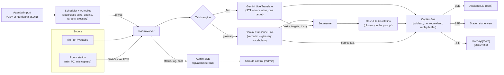

# Glosa

*[Leer en español](README.es.md)*

Open-source, event-centric live captioning and translation for conference
talks. Point Glosa at an audio source — a stream URL, a YouTube link, or a
mini PC capturing a stage's audio desk — and it captions and translates the
talk in real time to a phone, a stage screen or an OBS/vMix overlay. Load
the event's agenda once and an autopilot opens and closes each room's talks
on schedule, switching language, engine and glossary with it, so nobody has
to press start/stop per talk. It runs on two interchangeable Gemini engines
— a fast, fluent one and a glossary-accurate one for technical talks — at
up to **≈33× less than the public list price** of a commercial
live-captioning SaaS (see [Costs](#costs) and
[`docs/costs.md`](docs/costs.md)).

## Screenshots

| | |
|---|---|
|  Room list (`/`) |  Live captions (`/s/{room}`), desktop |
|  Live captions, mobile |  Admin ("Sala de control"), all clear |
|  Admin, Atención bar with an issue |  A room's drawer (mode, reconnect, station, exports) |
|  Room station (`/station/{room}`) |  OBS/vMix overlay (`/overlay/{room}`) |
|  Printable QR page (`/qr/{room}`) | |

More screenshots (light/dark/high-contrast themes, bilingual view, the
agenda editor, login): `docs/screenshots/*.png`.

## Quick start

```bash
git clone https://github.com/martin-paladino/glosa.git && cd glosa
cp .env.example .env   # fill in GEMINI_API_KEY and ADMIN_PASSWORD, see Configuration below
make demo               # or: docker compose up
```

Open **http://localhost:8000**. Two rooms come up captioning the bundled
sample clips (`samples/en_clip.opus`, `samples/es_clip.opus`) at real speed,
in English and Spanish, each with a live translation into the other
language. `make demo` / plain `docker compose up` run Gemini for real
(costs about $0.10 for the two ~90s clips); `make demo-fake` /
`GLOSA_CONFIG=config.demo-fake.yaml docker compose up` do the same with no
API key and no cost, replaying a recorded session instead. `make demo`'s
clips play once (~90s) and then the room goes idle; `make demo-fake`'s
rooms loop their ~90s clip instead, so it keeps captioning if you take a
minute to look around. Either way, `/admin`'s room drawer has
**"Probar con audio"** to replay a clip (or an uploaded one) on demand.

To run your own event instead of the demo:

```bash
cp config.example.yaml config.yaml   # describe your rooms, agenda, branding
make run                              # or, with Docker: see below
```

`config.yaml` is never touched by `make demo`/`make demo-fake` (they use
the versioned `config.demo.yaml` / `config.demo-fake.yaml` instead), so you
can try the demo and set up your real event side by side.

**Running your own event with Docker:** `config.yaml` is deliberately never
baked into the image (see `.dockerignore`) or read from the host's
environment (see *Secrets*, below), so mount it explicitly and point
`GLOSA_CONFIG` at it:

```bash
GLOSA_CONFIG=config.yaml docker compose run --rm -p 8000:8000 -v "$PWD/config.yaml:/app/config.yaml:ro" glosa
```

or add the same volume line to a local `docker-compose.override.yml`
(Compose merges it automatically) so plain
`GLOSA_CONFIG=config.yaml docker compose up` picks it up every time.

## Configuration

### Secrets (`.env`)

| Variable | Required | What it's for |
|---|---|---|
| `GEMINI_API_KEY` | yes | Drives live captioning/translation (Gemini Live). Get one at [Google AI Studio](https://aistudio.google.com/). Billed per minute of audio (see [Costs](#costs)); `make demo-fake` needs no key at all. |
| `ADMIN_PASSWORD` | yes | The single password for `/admin`. At least 8 characters — Glosa refuses to start otherwise. Use a long random one, e.g. `openssl rand -base64 18`; it's the only thing standing between the internet and your rooms' controls and the room stations' capture keys. |
| `TYPESAFE_API_KEY` | no | Enables the Jev quality meter and the "switch to manual?" talk-check suggestion. Leave blank to skip both — everything else works without it. With a key set, the quality meter scores one caption pair every 15 s per room, English↔Spanish only; the talk check asks, every 30 s per auto-mode room with a talk live, whether the last minute of captions still matches the scheduled talk, and suggests manual mode (an admin panel notice, never automatic) after two mismatches in a row. Rooms without a key keep the "quality" reading as "—" and never get the suggestion. |

Secrets live only in `.env` (gitignored) and are read from that file
directly, never from the shell/container environment (so a stray exported
variable, or `docker inspect`, can't leak them — see `docker-compose.yml`'s
comment). Never put them in `config.yaml` or commit them. `.env` is read
from the working directory by default; point it elsewhere with
`GLOSA_ENV_FILE` (same idea as `GLOSA_CONFIG` above, e.g. to run more than
one instance from different secrets without `cd`-ing between them).

### Event (`config.yaml`)

Copy `config.example.yaml` to `config.yaml`. Every key is optional; what
you omit falls back to `glosa/config.py`'s defaults. The essentials:

```yaml
event_name: Nerdearla Vibeathon 2026
timezone: America/Argentina/Buenos_Aires
audience_mode: all   # or "qr_only": no public room list, only the QR link works
ui_language: es      # "es" | "en" | "auto" (follow the browser's Accept-Language)

rooms:
  - id: main
    name: Main Stage
    agenda_names: [gran-sala]     # how the external agenda refers to this room
    source_type: youtube          # file | url | youtube | emitter (room station)
    source_url: "https://www.youtube.com/watch?v=..."
    language: es                  # this room's free-session source language
    default_targets: [en]

engine_mode: live       # "fake" replays a recorded session, no API key needed
default_engine_en: fast # engine for an English talk that doesn't specify one
db_path: data/glosa.db
budget_usd: 10.0
exports_public: true

prices: { lt_per_min: 0.0368, transcribe_per_min: 0.009, flash_lite_in_per_m: 0.30, flash_lite_out_per_m: 2.50 }
relay: { standby_at: 510, force_at: 570, stall_timeout: 8.0 }   # Live Translate session handoff
vad: { pause_ms: 400, min_speech_s: 1.5 }
segmenter: { comma_min_words: 5, max_words: 14, max_wait_s: 3.0 }
```

`branding.logo_url`/`primary`/`accent` set the event's look (the bundled
Nerdearla logo can be swapped for your own). Full key-by-key reference:
`config.example.yaml`'s comments and `glosa/config.py`'s `Settings`.

## How it works



- **RoomWorker** (`glosa/room.py`) owns one room's whole life: its audio
  source, engine session, translation lane and status. One `RoomWorker`
  runs as its own set of `asyncio` tasks per room, in the same process —
  see [Scaling](#scaling).
- **Two engines, chosen per talk** (`engine: fast|glossary` in the agenda
  CSV or `PUT /api/admin/talks/<id>`; Spanish talks default to `glossary`,
  English to `default_engine_en`): **fast** is one Gemini Live Translate
  session doing STT and translation together, fluent but blind to the
  glossary; **glossary** is Gemini Transcribe Live (verbatim, fed the
  glossary as `customVocabulary`) followed by a segmenter and a Flash-Lite
  translation pass with the glossary in its prompt — slower per word but
  the only one that honors configured terms. See
  [`docs/alternatives.md`](docs/alternatives.md) for why.
- **Targets beyond the first** (a talk's `targets` list can hold more than
  one language) are translated from the already-transcribed source text by
  the same Flash-Lite lane the glossary engine uses, instead of opening a
  second live session — see [Costs](#costs).
- **`CaptionBus`** (`glosa/captions/bus.py`) is an in-process pub/sub with
  one topic per `(room, language)` and a bounded replay buffer, so a new or
  resuming SSE client catches up before switching to live delivery — see
  [Scaling](#scaling) for its fan-out numbers under load.
- **Agenda & autopilot**: import an agenda once (CSV or Nerdearla's
  sessions JSON, `POST /api/admin/agenda/import`) and each room in `auto`
  mode (the default) opens a talk 60 s before its scheduled start and
  closes it at its end, switching language, engine, targets and glossary
  with it; `manual` mode hands a room back to the operator. Full endpoint
  reference: [`docs/operator-guide.md`](docs/operator-guide.md).
- **Admin SSE** (`GET /api/admin/stream`) is the separate live feed behind
  `/admin`'s **"Sala de control"** panel: every room's status once a
  second, the event log, agenda changes and the spend meter — see
  [`docs/operator-guide.md`](docs/operator-guide.md) for what the panel
  shows and how to read it.

### What's in the box

- **Audience view** (`/`, `/s/{room}`): live captions per room over SSE,
  phone-first, EN/ES interface, light/dark/high-contrast themes.
  `/qr/{room}` is a printable or projectable page with that room's QR
  code. `audience_mode: qr_only` hides the room list at `/` entirely and
  only accepts a room's QR link (`/s/{token}`), for an event that doesn't
  want its room list guessable or public — in this mode nothing public
  reveals a room's slug↔token mapping or its captions without the token.
  On desktop, the room view's side room list folds to a rail (an icon
  toggle, remembered per browser) so captions get the freed width.
- **"¿Qué me perdí?" ("What did I miss?")** (room page, while a talk is
  live): a rolling 3-5 bullet recap of the last few minutes of captions
  per language, refreshed every 3 min (`GET /api/summary/{slug}/{lang}`,
  `gemini-3.5-flash-lite`) — for someone who just sat down.
- **Picture-in-Picture captions** (desktop, Chrome/Edge): a small
  always-on-top window with the last few caption lines, so captions stay
  visible while reading something else in another window.
- **Overlay for OBS/vMix** (`/overlay/{room}?lang=es&lines=2&size=48`, add
  `&logo=1` for the event logo): a transparent, chrome-less page a vMix
  browser input or an OBS browser source reads, burning translated
  captions into the stream. In `qr_only` mode use `/overlay/s/{token}`
  instead of the slug form.
- **Admin** (`/admin`, "Sala de control"): every room is a monitor with its
  live captions, a status light and its time on air. The **Atención** bar
  lists only what needs action now (a room down or degraded and why, the
  budget at 80%, a room turned red because Gemini's monthly spending cap
  or prepaid credit ran out — it retries every 30 s and recovers on its
  own once the limit is raised —, a silence alarm); a room's row carries a one-click
  reconnect/reopen-source button. Also: the spend meter, the event log,
  today's agenda with the next automatic
  change, the same light/dark/high-contrast theme toggle (**Tema**) and a
  **Shortcuts** button as the audience pages, tooltips on the engine/mode/
  drawer buttons, and a side drawer per room (click it or press 1–9; Esc
  closes) with auto/manual, start/end talk (an agenda talk or a free session),
  reconnect, a **"QR para el público"** link to the room's `/qr/{room}`
  page, **"Probar con
  audio"** (play a sample or an uploaded clip through the room to judge
  quality without a live talk — refused while an agenda talk is open or
  due), **"Escuchar el audio"** (an admin can listen to that test clip
  synchronized with the captions), an exports list (finished free sessions
  included), every metric against its limit and the room's history, and —
  for a room station — its connection state, link, QR code and **"Recargar
  estación"**. See
  [`docs/operator-guide.md`](docs/operator-guide.md) for the full button
  reference.
- **Jev talk-mismatch suggestion** ("¿Pasar a manual?", admin only, needs
  `TYPESAFE_API_KEY`): a panel notice — never automatic — when the last
  minute of an auto-mode room's captions stops matching the scheduled
  agenda talk.
- **The silence gate** stops billing audio between talks and during long
  pauses — see [Scaling](#scaling).
- **Local mode** runs captioning and translation 100% on-device with no
  cloud API (Apple silicon only) — see [Local mode
  (no cloud)](#local-mode-no-cloud).
- **Docker**: `docker-compose.yml` builds the same app, mounts `.env` and
  persists `data/` (the SQLite database: agenda, captions, events, cost)
  across restarts.

### Room stations (mini PC per stage)

Configure a room with `source_type: emitter` in `config.yaml` and its mini
PC opens `/station/<room>?key=<station_key>` instead of a SaaS tab: it
captures the audio desk's feed from the browser, streams it to Glosa, and
shows the room's own captions full screen for the stage screens
(`docs/field-notes.md` has the story behind this — see
[Operation](#operation)). The URL is stable across a server restart, and is
revoked by changing `ADMIN_PASSWORD`. A remote reload ("F5 remoto", no more
remote desktop) is one click in the admin (`POST
/api/admin/rooms/<id>/station/reload`).

**The key never leaks.** Every page sends `Referrer-Policy: same-origin`,
so a station's `?key=...` is never sent as a Referer to the Google Fonts
request `base.html` makes. Glosa's own logs (uvicorn's) have every
`key=<...>` rewritten to `key=REDACTED` before they're written. A reverse
proxy in front of Glosa keeps its **own** log, though, so redact there too
— for Caddy:

```caddyfile
log {
	format filter {
		wrap console
		fields {
			request>uri query {
				replace key REDACTED
			}
		}
	}
}
```

**HTTPS is required.** Browsers only allow microphone capture
(`getUserMedia`) in a secure context; a mini PC opening `http://<server>:
8000` on the venue network cannot capture audio, and the station page
explains this on screen instead of failing silently. See
[Deployment](#deployment).

**Kiosk mode**, for an unattended mini PC:

```bash
google-chrome \
  --kiosk "https://<your-domain>/station/<room>?key=<station_key>" \
  --autoplay-policy=no-user-gesture-required \
  --user-data-dir=/home/glosa/chrome-station-<room>
```

`--kiosk`: full screen, no browser chrome. `--autoplay-policy=no-user-
gesture-required`: lets the page start its `AudioContext` on load. A
**persistent** `--user-data-dir` (a real path) is what makes the
microphone permission stick across restarts and reboots — grant it once.

## Results

### Load: caption fan-out

Simulated load test (Task 15a, `bench/load_test.py`; a real server,
`engine_mode: fake`, zero API spend), Apple M4 / 10 cores / 16 GB:

| Rooms | Clients | Duration | Losses | Fan-out p50 / p95 / p99 (ms) | Server CPU avg / peak | Result |
|---|---|---|---|---|---|---|
| 5 | 50 | 20 s | 0 | 0.9 / 3.1 / 4.1 | 5.3% / 59.6% | PASS |
| 50 | 500 | 60 s | 0 | 0.8 / 1.9 / 4.8 | 17.9% / 62.5% | PASS |
| 100 | 1000 | 60 s | 0 | 0.6 / 1.6 / 6.3 | 23.6% / 95.4% | FAIL (CPU) |

The plan-scale run (50 rooms / 500 concurrent audience connections / 60 s)
passes with headroom on every criterion (no losses, no reconnects, CPU
well under 80%). At 2× scale, fan-out delay stays just as good, but
opening 1000 SSE connections within about a second spikes server CPU to
93–95% for a couple of samples — a one-time connection-establishment
burst, not sustained fan-out cost (steady-state CPU at 1000 clients is
~23%, barely above the 500-client steady state). Full method, findings and
reproduction command: [`bench/load-results.md`](bench/load-results.md).

### Engine latency and quality

<!-- BENCH-RESULTS -->
| Clip | Engine | Source text lag p50 / p90 | Translation lag p50 / p90 | Fidelity | Fluency | Glossary terms | US$/h |
|---|---|---|---|---|---|---|---|
| EN talk → ES | fast (Live Translate) | 1.28 / 2.08 s | 1.40 / 3.84 s | 4/5 | 3/5 | 94 % | 2.19 |
| EN talk → ES | glossary (Transcribe Live + Flash-Lite) | **0.80 / 1.48 s** | **1.34 / 3.02 s** | 3/5 | 2/5 | **100 %** | **0.75** |
| ES talk → EN | fast (Live Translate) | 1.66 / 2.35 s | 2.57 / 3.90 s | 5/5 | 4/5 | 100 % | 2.16 |
| ES talk → EN | glossary (Transcribe Live + Flash-Lite) | **0.74 / 1.57 s** | 3.22 / 5.17 s | 4/5 | 3/5 | 100 % | **0.75** |

Real Gemini APIs, real-time pace, ~93 s clips of real Nerdearla talks, one run each (US$0.20 in total, glossary rows re-run on 2026-09-25 after the fluency fix). Lag = how far the captions trail the speaker, measured on cumulative word curves against YouTube word timings; fidelity/fluency by an LLM judge (`gemini-3.8-flash`) against a reference translation — noisy at n=1, read them as directional. Full method, raw recordings and `make bench`: [`bench/results.md`](bench/results.md). Default: `fast` for English talks (more fluent), `glossary` for Spanish talks (3× cheaper, honours the glossary).


The glossary engine's own latency, measured live during this build (6 runs
of 60 s of Spanish audio, `.superpowers/sdd/2026-09-24-glosa/progress.md`):
source (transcription) **p50 ≈ 0.9 s** after end of speech, translation
**p50 ≈ 0.7 s** after the cut. Full latency/cost table for both engines,
with sources: [`docs/alternatives.md`](docs/alternatives.md).

## Costs

Per room-hour, one target language (Gemini's list prices, `glosa/config.py`):

| Engine | US$/min | US$/hour | Glossary? |
|---|---|---|---|
| **fast** (Live Translate) | 0.0368 | ≈ US$2.21 | No |
| **glossary** (Transcribe Live + Flash-Lite) | ≈0.012 | ≈ US$0.72 | Yes |

Each extra target language (beyond the first) adds one more Flash-Lite
translation pass over the same transcribed text, at roughly the glossary
engine's own translation cost — no new transcription session.

**vs. a commercial live-captioning SaaS**, public list price surveyed
2026-09-23: **≈ US$24/h per translated language**. At the same scale, that
is roughly **11×** the fast-engine cost above and **≈33×** the
glossary-engine cost — a list-price-to-list-price comparison, not a
negotiated rate on either side. Full breakdown (event-scale estimates,
this build's own spend, server cost, the budget cap): see
[`docs/costs.md`](docs/costs.md).

## Local mode (no cloud)

`engine_mode: local` runs captions + translation entirely on-device on an
Apple-silicon Mac — no Gemini, no internet, no API key spent. It's a
**demo/fallback mode** ("no internet at the venue"), honest about its
limits: **1–2 rooms per machine**, and neither the transcription nor the
translation applies the talk's glossary (see the limits below). It uses
[Parakeet](https://huggingface.co/mlx-community/parakeet-tdt-0.6b-v3)
(`parakeet-mlx`) for speech-to-text and
[TranslateGemma](https://huggingface.co/mlx-community/translategemma-4b-it-4bit)
(`mlx-lm`) for translation, both via [MLX](https://github.com/ml-explore/mlx).

```bash
uv sync --extra local   # Apple silicon only; downloads mlx, mlx-lm, parakeet-mlx
make demo-local          # PORT=8014; downloads ~4.5 GB of model weights on first run
```

`glosa/engines/local.py` (`LocalParakeetEngine`) and
`glosa/text/local_translator.py` (`LocalTranslator`) implement the same
`Engine`/`Translator` contracts as the cloud engines, so the rest of the
pipeline (glossary lane, segmenter, captions, exports) is unchanged; local
mode coerces every talk to the glossary-engine *path* (there is no local
Live Translate), whatever the talk's own `engine` setting.

**Measured** (2026-09-25, the build machine — Apple M4, 16 GB — real-time
runs of the bundled `samples/en_clip.opus`/`es_clip.opus`, ~93 s each,
`bench/bench_local.py`, reusing `bench/json3.py`'s progress-lag metric):

| Rooms | Clip | Source latency p50/p90 | Translation lag p50/p90 | CPU% avg/max | RSS MB avg/max | MLX peak memory |
|---|---|---|---|---|---|---|
| 1 | en→es | 1.6 s / 2.6 s | 3.7 s / 5.5 s | — | — | 6.0 GB |
| 2 | en→es | 3.8 s / 6.2 s | 6.6 s / 10.3 s | 44% / 101% | 571 / 1333 | 5.8 GB |
| 2 | es→en | 5.3 s / 7.6 s | 7.2 s / 9.1 s | (same process) | (same process) | (same process) |

Both models stay loaded once per process (one shared instance, one lock,
behind a dedicated thread — MLX's compute streams are thread-local, a
known issue across the MLX ecosystem as of mlx 0.31+); a second room roughly
doubles the latency because it now waits its turn on that one lock. Both
1- and 2-room runs kept up with real time (total wall time ≈ the clip's own
length): the bottleneck is per-call latency under load, not throughput.
CPU/RSS are this process's own (`ps`, sampled every 0.5 s); "MLX peak
memory" is `mlx.core.get_peak_memory()`, the models' own unified-memory
high-water mark, not the same figure as process RSS (Metal/unified memory
isn't fully reflected in RSS on Apple silicon). Ten translated segments per
clip, and the full run output, are in this build's task report
(`.superpowers/sdd/2026-09-24-glosa/task-16-report.md`).

**Limits, honestly:**
- **1–2 rooms per machine** — see the numbers above; a third concurrent
  room would queue behind the same lock and push latency well past what a
  live audience can read comfortably.
- **The glossary is not applied**, to either the transcription or the
  translation. Parakeet has no custom-vocabulary hook (unlike
  transcribe-live's `customVocabulary`); TranslateGemma's prompt format
  (verified against its own `chat_template.jinja`) has no slot for extra
  instructions beyond the segment and its source/target language codes.
- **No cross-segment context** for translation (Translator normally passes
  the last couple of segments for continuity; local mode translates each
  segment independently).
- **Rolling-window transcription, not true streaming.** `parakeet-mlx`
  does offer a real streaming decoder, but it wasn't judged worth the
  added lifecycle complexity (a stateful KV-cache/attention-mode context
  per room, shared carefully across a process-wide model) for a
  lowest-priority hackathon fallback; instead it re-transcribes the open
  utterance's buffered audio with the plain batch decode path, which the
  numbers above show is fast enough at this scale.
- **Packaging:** the `local` extra (`pyproject.toml`) is gated on
  `sys_platform == 'darwin' and platform_machine == 'arm64'`, so a
  Linux/Docker install is unaffected; unit tests inject fake
  transcribe/generate callables and never need mlx installed.

## Alternatives evaluated

Glosa's two engines were chosen after benchmarking them against each
other and against Soniox, OpenAI's realtime translation, Whisper, Gemma,
Gemini Omni, a local NVIDIA Parakeet setup, and TypeSafe Jev (both as a
segmentation heuristic and as the quality meter Glosa ships). Full tables
with latency, cost, glossary support and sources:
[`docs/alternatives.md`](docs/alternatives.md).

## Scaling

- **One Glosa instance runs one event.** Each room is its own set of
  `asyncio` tasks (audio ingest, engine session, translation lane) inside
  a single process — no external queue or worker pool. `CaptionBus`'s
  pub/sub fan-out measured p95 1.9 ms / p99 4.8 ms at 50 rooms / 500
  concurrent audience connections, with server CPU peaking at 62.5% of one
  core — see [Results](#results).
- **One instance comfortably handles about 10–20 rooms captioned at
  once.** The bottleneck is the number of concurrent Gemini Live sessions
  and their network I/O (each room keeps 1–2 sessions open for
  session-handoff overlap), not CPU — ffmpeg, VAD and segmentation are
  cheap per room. What to size: Gemini's per-tier rate/concurrency limits
  (check Google AI Studio ahead of time), and, for `file`/`url`/`youtube`
  rooms, one `ffmpeg` subprocess per room (roughly 115 CPU-percentage-
  points and ~150 MB RSS at 50 such rooms in the load test) — a
  deployment using mostly `emitter` room stations (mini PCs push audio in;
  no local `ffmpeg`) needs much less.
- **Beyond ~20 rooms, split across instances** — one process per
  building/track, each with its own `config.yaml` subset of rooms and its
  own `db_path` (SQLite; no shared state between instances). Point each
  instance's admin panel and audience links at its own host/port.
- **Budget by audio-minutes**, not by room count: see [Costs](#costs).
- **The silence gate stops billing audio between talks and during long pauses.** After `silence_gate_s` (default 20 s, 0 disables — `config.yaml`) with no voice, a room stops sending audio to the engine (a 1 s pre-roll is kept and replayed first when speech returns, so nothing is lost); over a day with idle stretches between talks this can meaningfully cut the audio-minutes billed per room. The cumulative seconds saved are in each room's status (`gated_s`), and "silence gate: paused Ns" shows in the admin's per-room detail while active.

## Deployment

```bash
docker compose up   # builds the image, mounts .env and data/ (see Quick start)
```

Room stations need HTTPS (browsers only allow microphone capture in a
secure context) — three ways, in order of how close to a real venue they
are: **`deploy/Caddyfile`** (a reverse proxy that gets a real Let's
Encrypt certificate, or a LAN-only self-signed one via `tls internal`;
`docker-compose.yml` has a commented-out `caddy` service for it, and it
sets `flush_interval -1` so live captions aren't buffered); an **HTTPS
tunnel** (ngrok, Cloudflare Tunnel, Tailscale Funnel...) to
`localhost:8000` for a quick rehearsal; or, lab-only, Chrome's
`--unsafely-treat-insecure-origin-as-secure` flag — never for a real
event. Full setup and kiosk-mode flags: [Room stations](#room-stations-mini-pc-per-stage).

**Where to run it:** a small cloud VM is enough — the FastAPI/uvicorn
process itself was load-tested at 62.5% peak CPU on one core for 50 rooms'
caption fan-out (see [Scaling](#scaling)); size mainly for the `ffmpeg`
fleet if using `file`/`url`/`youtube` rooms. The Gemini Live/Transcribe/
Flash-Lite calls that actually produce a caption are on the live path, so
pick a region with low network latency to the Gemini API — added
round-trip time there adds directly to caption latency. The optional Jev
quality-meter call (`TYPESAFE_API_KEY`) runs as a fire-and-forget
background task, at most once every 15 s per room, so its own latency
does not delay any caption.

## Operation

Full checklist and reference: [`docs/operator-guide.md`](docs/operator-guide.md)
(credentials, HTTPS, `config.yaml`, agenda import, room stations, reading
room status, autopilot, exports, backups). Why Glosa's operation model
looks the way it does: Nerdearla's own staff described their current
setup as a SaaS tab left running with a **remote-desktop** tool open "in case it needs
an F5 because it froze" — no dedicated operator per room, remote access to
every mini PC as the only recovery. Glosa's room stations, remote reload
and autopilot exist specifically to remove that: see
[`docs/field-notes.md`](docs/field-notes.md) for the full story, in the
organizers' own words.

## Subtitle a file (how the demo video's subtitles were made)

`scripts/subtitle_file.py` turns any ffmpeg-readable video or audio file
into subtitles, using Glosa's own real pipeline (a real `RoomWorker`, the
real Gemini engines) instead of a separate transcription tool — this is how
this project's own hackathon demo video got its English subtitles from a
Spanish-narrated screen recording:

```bash
make subtitles FILE=recording.mp4 LANG=es TARGETS=en
# or directly:
uv run python scripts/subtitle_file.py recording.mp4 --lang es --targets en
```

Writes `recording.es.vtt`/`.srt` (the source language) and
`recording.en.vtt`/`.srt` (each `--targets` language) next to the input
file (`--out-dir DIR` to write elsewhere), using the same renderer and
caption-delay shift `GET /exports` uses. `--engine glossary|fast` picks the
engine (default `glossary`: accurate technical-term transcription; `fast`
is Live Translate, useful when the file isn't in Spanish or English).
`--glossary "term=translation,term2,..."` adds glossary terms (a bare term
keeps it in English). Reads `GEMINI_API_KEY` from `.env` like everything
else, runs at real-time pace, and prints the real cost when it's done.

## Development

```bash
make test   # fast suite, no API calls (pytest -m "not live")
```

Sample clips and their provenance: `samples/README.md`.

## License

Apache-2.0. See `LICENSE`.

**Trademarks:** the bundled Nerdearla logos are not covered by that
license — see
[`glosa/web/static/branding/nerdearla/NOTICE.md`](glosa/web/static/branding/nerdearla/NOTICE.md).
